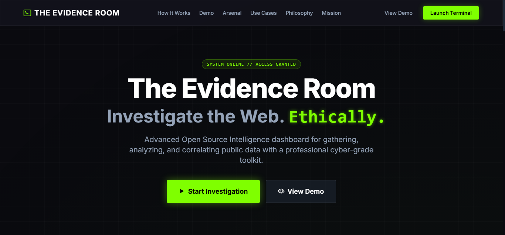

<div align="center">

# 🕵️ The Evidence Room OSINT

**An interactive OSINT investigation dashboard focused on ethical digital investigations, evidence organization, and case analysis**



[](https://developer.mozilla.org/en-US/docs/Web/HTML)
[](https://developer.mozilla.org/en-US/docs/Web/CSS)
[](https://developer.mozilla.org/en-US/docs/Web/JavaScript)
[](https://github.com/Blue-Rangoon/The-Evidence-Room-OSINT)
[](LICENSE)
[](https://github.com/Blue-Rangoon/The-Evidence-Room-OSINT)

[](https://github.com/Blue-Rangoon/The-Evidence-Room-OSINT/commits/main)
[](https://github.com/Blue-Rangoon/The-Evidence-Room-OSINT/stargazers)
[](https://github.com/Blue-Rangoon/The-Evidence-Room-OSINT/graphs/contributors)
[](https://github.com/Blue-Rangoon/The-Evidence-Room-OSINT)

[🌐 Repository](https://github.com/Blue-Rangoon/The-Evidence-Room-OSINT) • [🚀 Quick Start](#-quick-start) • [🗺️ Roadmap](#️-roadmap) • [🤝 Contributing](#-contributing) • [📜 License](#-license)

</div>

---

## 🕵️ About The Project

**The Evidence Room OSINT** is a modern investigative dashboard designed for organizing, exploring, and analyzing publicly available intelligence in an ethical and structured way.

The platform focuses on:

- Digital investigation workflows
- Evidence organization
- Timeline visualization
- Open-source intelligence research
- Case-based investigation systems

Built with a responsive and modular frontend architecture, the project aims to provide researchers, analysts, and developers with a professional environment for managing investigative data and visual evidence.

The long-term vision includes advanced visualization systems, collaboration tools, and ethical AI-assisted investigative workflows.

> ⚠️ This project is strictly focused on ethical OSINT practices and publicly available information.

---

## ⭐ Repository Visitors

<div align="center">

<!-- 
 -->

*Thanks for checking out the project. If you like it, consider giving it a ⭐*

</div>

---

## 🚀 Features

| Feature | Description |
|---------|-------------|
| 🗂️ **Case Dashboard** | Organized interface for managing investigation cases |
| 🔎 **OSINT Focused** | Designed around publicly available intelligence workflows |
| 📊 **Evidence Visualization** | Structured evidence layouts and future timeline integration |
| ⚡ **Responsive UI** | Optimized experience across desktop and mobile devices |
| 🧩 **Modular Architecture** | Scalable frontend structure for future expansion |
| 🌙 **Future Dark Mode** | Planned accessibility and dark theme support |
| 🤝 **Community Driven** | Open for contributors, researchers, and developers |
| 🔒 **Ethical Standards** | Built around responsible investigation practices |

---

## 🧠 Tech Stack

<div align="left">

### Frontend
| HTML5 | CSS3 | JavaScript |
|:-----:|:----:|:----------:|
|  |  |  |

### Future Integrations
| APIs | Data Visualization | AI Assistance |
|:----:|:------------------:|:-------------:|
|  |  |  |

</div>

---

## 📁 Project Structure

```bash
The-Evidence-Room-OSINT/
├── index.html                 # Landing page
├── templates/
│   └── dashboard.html         # Dashboard interface
├── scripts/
│   ├── index.js               # Core logic
│   └── dashboard.js           # Dashboard
├── styles/
│   ├── index.css              # Global styles
│   └── dashboard.css          # Dashboard styles
├── README.md
└── LICENSE
```

---

## 🚀 Quick Start

### Clone the repository

```bash
git clone https://github.com/Blue-Rangoon/The-Evidence-Room-OSINT.git
Navigate to the project directory
cd The-Evidence-Room-OSINT
Open index.html in your browser or use a local server (recommended)
# Using Python
python -m http.server 8000
```

Start exploring the dashboard and available cases.


## 🗺️ Roadmap
Phase 1: Foundation (Completed)

 Professional UI/UX design
 Responsive dashboard interface
 Modular JavaScript architecture
 AGPL v3 licensing and documentation

Phase 2: Core Functionality (Q3 2026)

 Advanced case database with powerful search & filters
 Interactive timelines and evidence visualization
 OSINT tool integration (public APIs & resources)
 Data import/export capabilities

Phase 3: Collaboration (Q4 2026)

 Community contribution system (with moderation)
 User accounts and role management
 Advanced analytics and graph visualizations
 Dark mode + enhanced accessibility

Phase 4: Future Vision (2027+)

 Ethical AI assistance for pattern detection
 Mobile application (PWA)
 Public API for researchers
 Integration with verified external databases


## 🤝 Contributing
We welcome contributions from developers, OSINT researchers, designers, and true crime analysts.
How to Contribute

Fork the repository
Create a new branch for your feature (git checkout -b feature/amazing-feature)
Commit your changes (git commit -m 'Add amazing feature')
Push to the branch (git push origin feature/amazing-feature)
Open a Pull Request

Contribution Guidelines

Follow the existing code style
Ensure responsiveness is maintained
Only use publicly available and ethically sourced information
Respect victims and their families in all cases

Pull Requests are highly appreciated. Please provide a clear description of the changes and why they are beneficial.

--- 

## 📜 License
This project is licensed under the GNU Affero General Public License v3.0 (AGPL-3.0) — see the [LICENSE](LICENSE) file for details.

---

## ⚠️ Ethical Statement
This platform is built with the highest respect for:

- Victims and their families
- Ongoing legal investigations
- Privacy laws and ethical OSINT practices

>Doxxing, harassment, or misuse of private information is strictly prohibited.


---

<div align="center">

**Made with ❤️ by Saad Ali Rizvi**

[](https://github.com/Blue-Rangoon)
[](https://linkedin.com/in/saad-ali-rizvi/)
</div>
